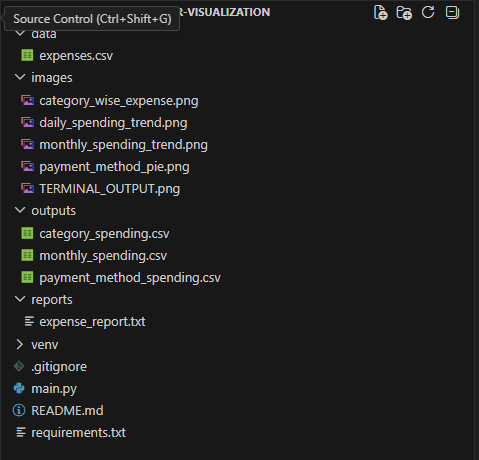
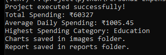
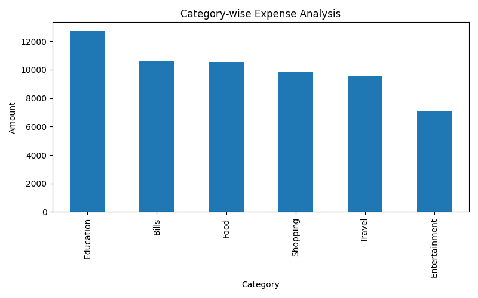
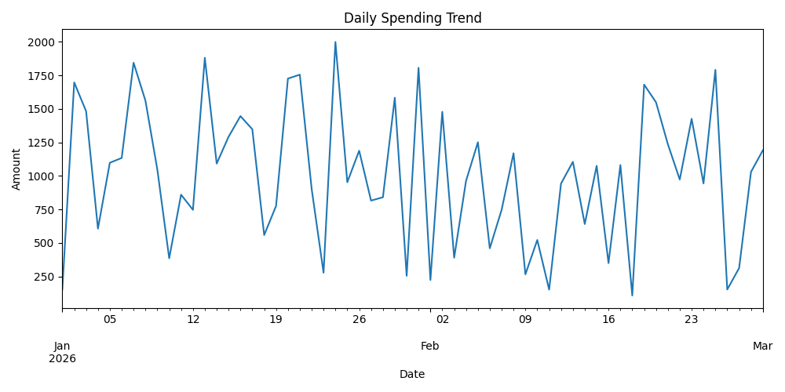
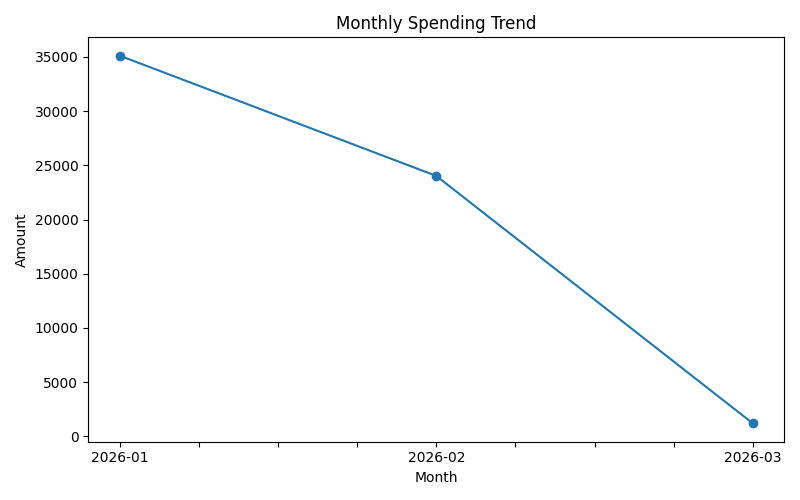
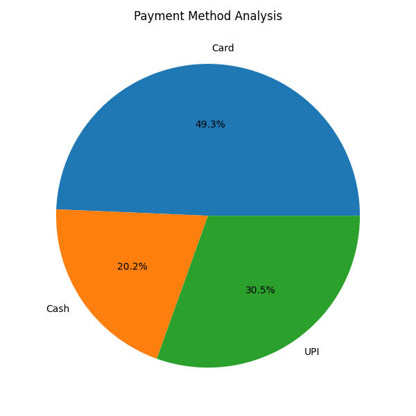

---

## 📌 Project Overview

**Personal Expense Tracker with Data Visualization** is a Python-based finance analytics project that helps users track daily expenses, analyze spending patterns, and generate useful financial insights using CSV data.

This project is built using **Python, Pandas, NumPy, and Matplotlib**. It creates synthetic expense data, stores it in CSV format, performs analysis, generates visual charts, and creates a final report.

---

## 🎯 Problem Statement

Many students, employees, freelancers, and small businesses struggle to understand where their money is spent. Manual tracking is time-consuming and does not provide clear visual insights.

This project solves that problem by analyzing expenses category-wise, month-wise, payment-method-wise, and daily spending-wise.

---

## 🚀 Features

✅ Synthetic expense dataset creation  
✅ CSV-based expense storage  
✅ Category-wise spending analysis  
✅ Monthly spending trend analysis  
✅ Payment method analysis  
✅ Daily spending trend visualization  
✅ Highest spending category detection  
✅ Average daily spending calculation  
✅ Automated report generation  
✅ GitHub-ready project structure  

---

## 🛠️ Tech Stack

| Technology | Use |
|---|---|
| Python | Core programming |
| Pandas | Data analysis |
| NumPy | Synthetic data generation |
| Matplotlib | Data visualization |
| CSV | Data storage |
| GitHub | Project hosting |

---

## 📂 Project Structure

```bash
Personal-Expense-Tracker-Visualization/
│
├── data/
│   └── expenses.csv
│
├── outputs/
│   ├── category_spending.csv
│   ├── monthly_spending.csv
│   └── payment_method_spending.csv
│
├── images/
│   ├── category_wise_expense.png
│   ├── daily_spending_trend.png
│   ├── folder_Structure.png
│   ├── monthly_spending_trend.png
│   ├── payment_method_pie.png
│   └── TERMINAL_OUTPUT.png
│
├── reports/
│   └── expense_report.txt
│
├── main.py
├── requirements.txt
├── README.md
└── .gitignore
````

---

## 📊 Project Screenshots

### 📁 Folder Structure

<p align="center">
  
</p>

---

### 🖥️ Terminal Output

<p align="center">
  
</p>

---

### 📊 Category-wise Expense Analysis

<p align="center">
  
</p>

---

### 📈 Daily Spending Trend

<p align="center">
  
</p>

---

### 📉 Monthly Spending Trend

<p align="center">
  
</p>

---

### 💳 Payment Method Analysis

<p align="center">
  
</p>

---

## ⚙️ Installation

### 1️⃣ Clone Repository

```bash
git clone https://github.com/Atharvbunde/Personal-Expense-Tracker-Visualization.git
cd Personal-Expense-Tracker-Visualization
```

### 2️⃣ Create Virtual Environment

```bash
py -m venv venv
```

### 3️⃣ Activate Virtual Environment

```bash
venv\Scripts\activate
```

### 4️⃣ Install Requirements

```bash
pip install -r requirements.txt
```

### 5️⃣ Run Project

```bash
py main.py
```

---

## ✅ Expected Output

After running the project, it automatically generates:

```txt
Project executed successfully!
Total Spending: ₹xxxxx
Average Daily Spending: ₹xxxx
Highest Spending Category: Food
Charts saved in images folder.
Report saved in reports folder.
```

---

## 📈 Generated Outputs

| Output File                           | Description             |
| ------------------------------------- | ----------------------- |
| `data/expenses.csv`                   | Expense dataset         |
| `outputs/category_spending.csv`       | Category-wise spending  |
| `outputs/monthly_spending.csv`        | Monthly spending        |
| `outputs/payment_method_spending.csv` | Payment method analysis |
| `reports/expense_report.txt`          | Final summary report    |

---

## 🧠 Workflow

```txt
Expense Data Entry
        ↓
CSV Data Storage
        ↓
Data Cleaning
        ↓
Category-wise Analysis
        ↓
Monthly Trend Analysis
        ↓
Payment Method Analysis
        ↓
Data Visualization
        ↓
Final Report Generation
```

---

## 💼 Industry Relevance

This project is useful for:

* Python Developer portfolio
* Data Analyst portfolio
* Business Analyst projects
* Finance Analytics projects
* Automation projects
* Student academic submission
* GitHub proof of work

---

## 🎓 Learning Outcomes

Through this project, I learned:

* How to create and manage CSV datasets
* How to clean and analyze data using Pandas
* How to generate synthetic data using NumPy
* How to create charts using Matplotlib
* How to automate report generation
* How to structure a GitHub-ready Python project
* How to present data insights visually

---

## 🧾 Sample Insights

The project can answer questions like:

* Which category has the highest spending?
* What is the total monthly spending?
* Which payment method is used the most?
* What is the average daily spending?
* How does spending change over time?

---

## 🔮 Future Scope

* Add Streamlit dashboard
* Add real-time manual expense entry
* Add budget limit alerts
* Add monthly savings prediction
* Add Excel report generation
* Add database support using SQLite
* Add user login system

---

## 👨‍💻 Author

**Atharv Vishnudas Bunde**
Mechatronics Student
## ⭐ Support

If you like this project, give it a ⭐ on GitHub.

````

